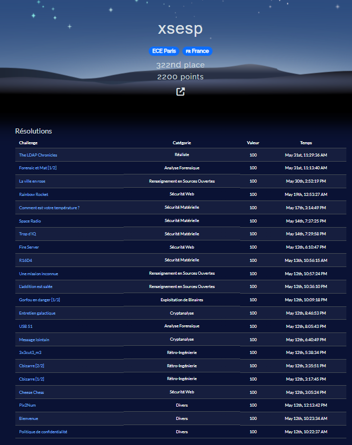
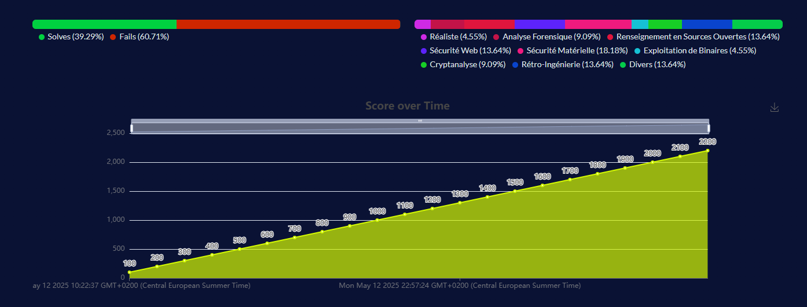

# 2025-DGSE-404CTF
CTF proposé par la DGSE, du 10 mai 2025 au 01 juin 2025.

Je ne vais pas écrire de WriteUp sur ce challenge, car je ne l'ai pas fait sérieusement (peu de temps et prises de notes assez brouillon - c'était surtout pour m'entraîner entre mes révisions de fin d'études).
Cependant, c'est mon troisième CTF, et je reste assez content de ma place 322éme/~2893, avec des flag trouvés sur quasi toutes les catégories (9 catégories sur les 11).

L'idée pour mes prochains CTF c'est de m'améliorer spécifiquement sur l'exploitation de binaires et le reverse.

